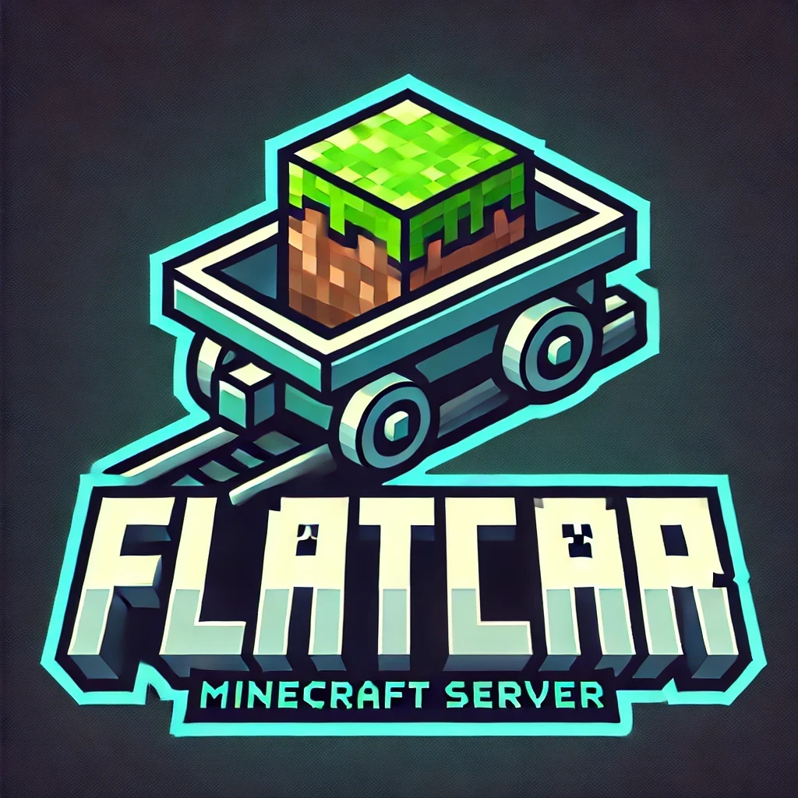

# Flatcar Minecraft Server



> **A lightweight, containerized PaperMC setup on [Flatcar Container Linux](https://www.flatcar.org/).**
> **Easily deployable on Azure or any other cloud/provider.**


---

## Table of Contents

- [Flatcar Minecraft Server](#flatcar-minecraft-server)
  - [Table of Contents](#table-of-contents)
  - [Introduction \& Purpose](#introduction--purpose)
    - [Why Flatcar?](#why-flatcar)
    - [Why Containers for Minecraft?](#why-containers-for-minecraft)
    - [Optional SFTP \& Java Tiers](#optional-sftp--java-tiers)
  - [Prerequisites \& Requirements](#prerequisites--requirements)
    - [Notes on Firewalls \& Security](#notes-on-firewalls--security)
  - [Overview of Steps](#overview-of-steps)
    - [3.1 Environment Variables \& Java Tiers](#31-environment-variables--java-tiers)
      - [Common Env Vars](#common-env-vars)
    - [3.2 Detailed Java/G1GC Settings](#32-detailed-javag1gc-settings)
    - [3.3 Memory Tiers and Aikar’s Flags](#33-memory-tiers-and-aikars-flags)
      - [Where to Change Settings](#where-to-change-settings)
    - [3.4 SFTP Service Explanation](#34-sftp-service-explanation)
  - [Summary of `config.yaml` Contents](#summary-of-configyaml-contents)
    - [4.1 `papermc.env` (Base Environment File)](#41-papermcenv-base-environment-file)
    - [4.2 Tiered Environment Files (`minimal.env`, `small.env`, `medium.env`, `large.env`)](#42-tiered-environment-files-minimalenv-smallenv-mediumenv-largeenv)
    - [4.3  `custom.env`](#43--customenv)
    - [4.4 `sshd-sftp.service` (Alternate SFTP on Port 2223)](#44-sshd-sftpservice-alternate-sftp-on-port-2223)
    - [4.5 `minecraft.service` (Main PaperMC Service)](#45-minecraftservice-main-papermc-service)
      - [Systemd Units for Docker \& Enabling Services](#systemd-units-for-docker--enabling-services)
  - [Example: Running Flatcar Locally with QEMU](#example-running-flatcar-locally-with-qemu)
    - [5.1 Download the Flatcar QEMU Image](#51-download-the-flatcar-qemu-image)
    - [5.2 Prepare Your Ignition (Butane) Config](#52-prepare-your-ignition-butane-config)
    - [5.3 Launch QEMU with Port Forwarding](#53-launch-qemu-with-port-forwarding)
    - [5.4 Watch Flatcar Boot \& Docker Start](#54-watch-flatcar-boot--docker-start)
    - [5.5 Interacting with Your Minecraft Server](#55-interacting-with-your-minecraft-server)
    - [5.6 Tweak \& Persist](#56-tweak--persist)
    - [Additional Reading \& Tips](#additional-reading--tips)
  - [Example: Deploying on Azure Cloud ☁️](#example-deploying-on-azure-cloud-️)
    - [6.1 Connect to Azure \& Understand the Cloud Shell](#61-connect-to-azure--understand-the-cloud-shell)
    - [6.2 Accept the Flatcar Image Terms](#62-accept-the-flatcar-image-terms)
    - [6.3 Set Variables](#63-set-variables)
      - [Picking a VM Size \& Understanding Azure Pricing](#picking-a-vm-size--understanding-azure-pricing)
    - [6.4 Create an Azure Resource Group](#64-create-an-azure-resource-group)
    - [6.5 Create a Virtual Network \& Subnet](#65-create-a-virtual-network--subnet)
    - [6.6 Prepare the Ignition File (Using Butane)](#66-prepare-the-ignition-file-using-butane)
    - [6.7 Deploy the Flatcar VM](#67-deploy-the-flatcar-vm)
    - [6.8 Open Ports for Minecraft](#68-open-ports-for-minecraft)
      - [Security Tip 🔐](#security-tip-)
    - [6.9 SSH into Your VM \& Check Services](#69-ssh-into-your-vm--check-services)
    - [6.10 Connecting to RCON](#610-connecting-to-rcon)
    - [6.11 Connecting via SFTP](#611-connecting-via-sftp)
  - [That’s It!](#thats-it)

---

## Introduction & Purpose

Welcome to the **Flatcar Minecraft Server** project! This repository shows how to run a [PaperMC](https://papermc.io/) server on **Flatcar Container Linux** in a **containerized** fashion. Although our examples focus on **Azure** (for convenience and clarity), you can use the same principles on **any** platform that supports Flatcar—be it your own data center, another public cloud, or even local VMs.

### Why Flatcar?

- **Immutable & Lightweight**: Flatcar is designed with container workloads in mind, providing a minimal, read-only root filesystem and automated updates.
- **Secure & Stable**: Its auto-update mechanism and minimal package footprint reduce attack vectors, meaning fewer maintenance headaches for your Minecraft server.
- **Container-First Approach**: Docker (or containerd) is built-in, so you can manage your Minecraft server as a portable container image.

### Why Containers for Minecraft?

- **Easy Upgrades & Rollbacks**: Want to update your server or switch to a different version? Just pull a new container image.
- **Separation of Concerns**: You don’t have to worry about installing Java or other system dependencies directly on the host.
- **Scalability**: Spin up additional containers on other Flatcar instances if you need more capacity or want a test environment.

### Optional SFTP & Java Tiers

1. **SFTP**: An optional SSH-based SFTP service makes uploading or editing server files (e.g., plugins, world data) straightforward—no extra file-transfer tooling needed beyond your standard SSH key.
2. **Java Configuration Tiers**: We provide multiple environment configs (Minimal, Small, Medium, Large, or a fully Custom) to match different server sizes. If you have just a few players, pick a smaller tier. If you’re running a bustling community, crank up the RAM and use the large tier.

Both are entirely **optional**. You can skip the SFTP container if you prefer other file management methods, and you can continue using your own Java flags if you don’t need our tiered approach.


---

<p align="center">
  <em>Ready to launch your PaperMC server on Flatcar? Let’s dive in!</em>
</p>


## Prerequisites & Requirements

Although our walkthrough includes **Azure** examples, you can adapt these steps to **any platform** that supports [Flatcar Container Linux](https://www.flatcar.org/)—on-prem, another public cloud, or even a local VM. Here’s what you’ll need:

- **Flatcar-Ready Environment**
  Any server or virtual machine running a Flatcar image, or the ability to create one (via Azure, AWS, your own hypervisor, etc.).

- **SSH Keys**
  Flatcar uses the `core` user with no default password, so you’ll typically log in with SSH keys. Make sure you have a key pair ready.

- **Butane** *(optional but recommended)*
  If you plan to **locally** generate your Ignition file from the Butane YAML, you’ll need the [Butane CLI](https://coreos.github.io/butane/) or Docker image. If you prefer, you can also write or edit the Ignition config directly.

- **Basic Container & CLI Knowledge**
  Because we’re containerizing Minecraft, knowing some Docker basics—like pulling images, viewing logs, or stopping containers—will help troubleshoot any issues.

### Notes on Firewalls & Security
- This example does **not** automatically configure OS-level firewalls beyond what Azure (or your cloud/provider) might offer. Make sure to open or secure ports if you’re using another environment.
- Always safeguard your SSH keys and RCON passwords.

> **Tip**: If you’re **not** using Azure, just skip any `az` commands in the examples and deploy your Flatcar instance by your platform’s usual means. Then apply the same Butane/Ignition configuration to set up Minecraft services.


## Overview of Steps

Below is a **high-level** outline of how you’ll set up and run your Minecraft server on Flatcar. Each step can be adjusted based on where you’re hosting (Azure, local VM, etc.):

1. **Set or Adjust Environment Variables**
   Decide on your Minecraft version, memory limits, RCON settings, and Java flags (GC tuning). These variables live in the Butane config—or can be edited later on the VM.

2. **Generate (or Obtain) the Final Ignition File**
   Using [Butane](https://coreos.github.io/butane/), convert the YAML config into an Ignition file (`config.ign`) that Flatcar understands.

3. **Deploy Your Flatcar Instance**
   Launch a new Flatcar machine—on Azure, AWS, or your local hypervisor—and provide the Ignition file as “custom data” (or “user data”).

4. **Open Ports / Configure Networking**
   Ensure Minecraft (25565), RCON (25575), and SFTP (2223) are accessible if you’re hosting publicly. On Azure, this means adding inbound security rules. On a local environment, you might modify your firewall or router.

5. **Verify & Manage Services**
   SSH into the box (`ssh core@...`) to check `minecraft.service` and (optionally) `sshd-sftp.service`. Tail logs, tweak environment variables, and restart if needed.

### 3.1 Environment Variables & Java Tiers

Running a Minecraft server on Flatcar requires a few key **environment variables** that tell the server (and Docker) how to behave. Understanding these variables helps you **customize** performance, game version, and server features.

#### Common Env Vars

- **EULA=true**
  Confirms you accept the Minecraft End User License Agreement. Without `true`, the server won’t start.

- **MC_VERSION / PAPER_BUILD**
  Controls which Paper build is used (e.g., `latest` for the newest version, or a specific tag like `1.20.1`).

- **MC_RAM**
  Sets how much memory the container can use (e.g., `4G`). Usually, you’ll match this with Docker’s `--memory="4g"` so it doesn’t get OOM-killed.

- **JAVA_OPTS**
  The big one: Java flags controlling heap size (`-Xmx`), GC tuning (`-XX:+UseG1GC`), and more. If your server lags or runs out of memory, you often adjust these.

- **ENABLE_RCON / RCON_PASSWORD / RCON_PORT**
  Enables the Minecraft server’s remote console. Set a strong password and open the port if you need external admin tools.

You can change these variables in **two main ways**:

1. **Before Provisioning**
   Edit the Butane config that sets up your server. This is ideal if you haven’t deployed yet, since the values will be “baked in” from the start.

2. **After Provisioning**
   If your server is already running, you can edit the file /etc/systemd/system/minecraft.service on the VM itself. After modifying it, run:

```bash
   sudo systemctl daemon-reload
   sudo systemctl restart minecraft.service
```

   This reloads the updated environment settings and restarts the server with them.

### 3.2 Detailed Java/G1GC Settings

Minecraft uses Java under the hood. By default, Java’s garbage collector might not be fully optimized for a busy server. Many players (and the PaperMC project) recommend **Aikar’s Flags**, a collection of GC tweaks that keep performance smoother.

Here’s a quick explanation of some commonly mentioned flags:

- **-Xms / -Xmx**
  Minimum (-Xms) and maximum (-Xmx) memory for Java. Example: -Xms4G -Xmx4G means “Start with 4 GB; don’t exceed 4 GB.”

- **-XX:+UseG1GC**
  Tells Java to use the G1 (“Garbage First”) garbage collector, which generally reduces lag spikes on larger heaps.

- **-XX:G1NewSizePercent / -XX:G1MaxNewSizePercent**
  Controls the “young” generation size within the heap, particularly important for Minecraft’s frequent creation and disposal of short-lived objects.

- **-XX:G1ReservePercent**
  Keeps a buffer of unused memory to avoid running out of space during garbage collection.

- **-XX:SurvivorRatio** and **-XX:MaxTenuringThreshold**
  These manage how objects move (or “promote”) from short-lived memory regions to longer-lived ones, keeping performance stable.

- **-XX:MaxGCPauseMillis**
  A target for maximum pause time during garbage collection. You can tune this if you see frequent or lengthy pauses.

- **-XX:+DisableExplicitGC**
  Prevents plugins or mods from forcing a garbage collection, which can cause sudden lag.

- **-XX:+AlwaysPreTouch**
  Pre-allocates memory on startup so the server doesn’t pause later to expand the heap.

- **-Dusing.aikars.flags / -Daikars.new.flags**
  Just markers indicating these are “Aikar’s recommended” settings.


### 3.3 Memory Tiers and Aikar’s Flags

Choosing how much memory to give your server is often a balancing act. Too little, and the server runs out of RAM; too much, and you might waste resources or see diminishing returns. Here are **rough guidelines**:

- **Minimal (~2 GB Docker Limit)**: ~1.5 GB Java heap
- **Small (~4 GB Docker Limit)**: ~3 GB Java heap
- **Medium (~8 GB Docker Limit)**: ~6 GB Java heap
- **Large (~12–16 GB Docker Limit)**: ~10+ GB Java heap

If you’re unsure, it’s best to start around **4 GB** (Small) and see how your server performs. Check usage with docker stats or in the game logs. If you have 10–20 players or a lot of plugins, you might need **8 GB** or more.

For an exact set of recommended flags (or if you have special requirements), visit PaperMC’s own [Start Script Generator](https://docs.papermc.io/misc/tools/start-script-gen). Just remember there is **no one-size-fits-all** solution—monitor your server and adjust.

#### Where to Change Settings

1. **In your Butane YAML**
   Change Environment="JAVA_OPTS=..." or Environment="MC_RAM=..." in your config before converting it into Ignition and deploying.

2. **On the Host (Post-Deployment)**
   - Open /etc/systemd/system/minecraft.service.
   - Edit the environment lines (e.g., Environment="JAVA_OPTS=...").
   - Run the commands:

bash
     sudo systemctl daemon-reload
     sudo systemctl restart minecraft.service

   - The new settings take effect immediately after restart.


### 3.4 SFTP Service Explanation

> This is **optional**. If you already have a preferred file-transfer method, skip it!

Besides Minecraft, you may want to **upload or download server files** easily (for example, to add plugins or manage world data). That’s why this setup includes an **SFTP service**:

- It **publishes port 2223** inside the VM, so you can connect from outside.
- We mount the Docker volume papermc-data to /home/core/papermc.
- We use the **Flatcar core user**, which relies on **SSH keys** by default, not passwords.

**Why SFTP?**
- It lets you drag and drop files (world folders, configuration files, etc.) without needing advanced Docker commands or an internal file manager.
- It’s more secure than traditional FTP because it uses SSH encryption.
- It’s separate from your main SSH service on port 22, so you can keep your standard SSH usage distinct from SFTP connections.

**How to Connect**:
Use an SFTP client (e.g., FileZilla, WinSCP, or the sftp command) with your **SSH key** and **port 2223**. For example:
bash
sftp -i ~/.ssh/id_rsa -P 2223 core@<vm-ip>

<!-- TODO more visual helps -->


You’ll see the papermc directory, and you can upload plugins, worlds, or other server files directly.


## Summary of `config.yaml` Contents

This **Butane configuration** creates multiple files and systemd units on Flatcar, each serving a unique role in managing your Minecraft server. Below is a high-level overview of each key piece, with **small snippets** from the config for clarity.


### 4.1 `papermc.env` (Base Environment File)

Holds the **universal** environment variables—like the Minecraft EULA acceptance, Paper version, default memory (`MC_RAM`), and RCON settings. This file is **always** loaded by the main `minecraft.service`.

```yaml
variant: flatcar
version: 1.0.0
storage:
  files:
    ########################################################################
    # 1) Base environment file (papermc.env)
    # ...
    ########################################################################
    - path: /etc/systemd/system/papermc.env
      mode: 0644
      contents:
        inline: |
          # We must accept the EULA for Minecraft.
          EULA=true
          # ...
```

These variables are **referenced by** `minecraft.service` and **apply universally**, regardless of which Java tier you select.

---

### 4.2 Tiered Environment Files (`minimal.env`, `small.env`, `medium.env`, `large.env`)

These **four environment files** each define different memory allocations and G1GC parameters tailored for various server sizes. You can pick **one** to load in `minecraft.service` (or skip them all in favor of `custom.env`).

For example, here’s the **small.env** snippet (heavily truncated for illustration):

```yaml
######################################################################
# 3) Small tier environment (small.env)
# ...
######################################################################
- path: /etc/systemd/system/small.env
  mode: 0644
  contents:
    inline: |
      JAVA_OPTS="-Xms3G -Xmx3G \
       -XX:+UseG1GC \
       -XX:+ParallelRefProcEnabled \
       # ...
```

- **Minimal:** ~1.5 GB heap (for ~2 GB Docker limit)
- **Small:** ~3 GB heap (for ~4 GB Docker limit)
- **Medium:** ~6 GB heap (for ~8 GB Docker limit)
- **Large:** ~10 GB heap (for ~12–16 GB Docker limit)

⚠️ **Pick** the one that fits your server’s resource limit by uncommenting its line in `minecraft.service`! ⚠️

---

### 4.3  `custom.env`

An **empty template** for those who want to define their **own** Java options without altering the provided configurations. If you want, say, 5 GB of heap and custom GC logging flags, just fill in `JAVA_OPTS` here and **uncomment** its reference in `minecraft.service`, while commenting out the other ones.

```yaml
######################################################################
# 6) Custom environment file (custom.env)
# ...
######################################################################
- path: /etc/systemd/system/custom.env
  mode: 0644
  contents:
    inline: |
      # Custom environment file for advanced or custom Java tuning
      #
      # Example usage:
      # JAVA_OPTS="-Xms5G -Xmx5G ..."
      #
      # By default, this is empty.
```

---

### 4.4 `sshd-sftp.service` (Alternate SFTP on Port 2223)

A **separate** systemd unit running `sshd` on port **2223** rather than the default 22, allowing you to **SFTP** into the server (with the `core` user’s SSH key). This is optional but makes file management simpler:

```yaml
######################################################################
# A separate SSHD-based SFTP service.
# ...
######################################################################
- path: /etc/systemd/system/sshd-sftp.service
  mode: 0644
  contents:
    inline: |
      [Unit]
      Description=Separate SFTP Server on Port 2223
      ...
```

---

### 4.5 `minecraft.service` (Main PaperMC Service)

Defines how Docker should run the **PaperMC server** container. It **loads** the base `papermc.env` plus **one** of the tiered `.env` files (or `custom.env` if you prefer). Key points:

- Binds ports **25565** (Minecraft) and **25575** (RCON).
- Passes environment variables (`EULA`, `JAVA_OPTS`, etc.) into the Docker run command.
- Mounts a volume (`papermc-data`) for persistent data (world, configs, etc.).

```yaml
######################################################################
# The main Minecraft systemd unit.
######################################################################
- path: /etc/systemd/system/minecraft.service
  mode: 0644
  contents:
    inline: |
      [Unit]
      Description=PaperMC Minecraft Server
      After=docker.service
      Requires=docker.service

      [Service]
      EnvironmentFile=/etc/systemd/system/papermc.env

      # Uncomment exactly ONE tier:
      #EnvironmentFile=/etc/systemd/system/minimal.env
      EnvironmentFile=/etc/systemd/system/small.env
      #EnvironmentFile=/etc/systemd/system/medium.env
      #EnvironmentFile=/etc/systemd/system/large.env
      # Or use:
      #EnvironmentFile=/etc/systemd/system/custom.env

      ...
```

This structure ensures you can **pick your tier** (Minimal, Small, Medium, Large, or Custom) without altering your main service definition.

---

#### Systemd Units for Docker & Enabling Services

At the end of the config, Butane **enables**:

- `docker.service` (ensures Docker starts at boot).
- `minecraft.service` (the main server).
- `sshd-sftp.service` (the optional SFTP process).

When Flatcar boots, these services **start automatically**, letting you jump right in and connect to your Minecraft server.
<!-- ########################################## -->


## Example: Running Flatcar Locally with QEMU

If you prefer a **local** setup on your own machine (for testing, development, or just tinkering around), you can run Flatcar Container Linux in a **QEMU** virtual machine. Below is an example workflow. For more details, refer to the [official Flatcar Docs on QEMU](https://www.flatcar.org/docs/latest/provisioning/booting-with-qemu/)—they have more thorough instructions, including different networking and drive configurations.

---

### 5.1 Download the Flatcar QEMU Image

Visit the [Flatcar Download Page](https://www.flatcar.org/releases/) or the [Flatcar Docs](https://www.flatcar.org/docs/latest/) to grab the **QEMU image**. You’ll typically see a file named something like `flatcar_production_qemu_image.img` along with a **helper script** such as `flatcar_production_qemu.sh`.

- Make sure you match the **version** of Flatcar you want (e.g., Stable, Beta, etc.).
- Place these files in a convenient directory on your local machine.

---

### 5.2 Prepare Your Ignition (Butane) Config

Just like with Azure (or any other environment), you’ll need an **Ignition** file (`config.ign`) that sets up Docker, systemd units, etc. If you have a **Butane YAML** (e.g., `config.yaml`), convert it to `config.ign`:

```bash
docker run --rm -i quay.io/coreos/butane:latest < config.yaml > config.ign
```

> **Tip**: If you’re not sure how to create this file, see the previous sections or the [Flatcar Docs](https://www.flatcar.org/docs/latest/provisioning/ignition/) on Ignition. The same **Minecraft + SFTP** example config can be used locally just as well as in the cloud.

---

### 5.3 Launch QEMU with Port Forwarding

The `flatcar_production_qemu.sh` script (packaged with the image) can streamline running QEMU. For example:

```bash
./flatcar_production_qemu.sh \
  -M 6144 \            # Allocate 6144 MB RAM to the VM
  -f 25565:25565 \     # Forward Minecraft port (25565) to host
  -f 25575:25575 \     # Forward RCON port (25575) to host
  -f 2223:2223 \       # Forward SFTP port (2223) to host
  -i ./config.ign \    # Provide the Ignition config
  -- -display curses
```

Here’s what these flags do:

- **`-M 6144`**: Sets the memory to ~6 GB. Adjust if you want more or less.
- **`-f 25565:25565`**: QEMU port forwarding. Traffic on the **host’s 25565** is forwarded into the VM’s 25565 (Minecraft).  
  - Repeat for other ports like RCON (25575) and SFTP (2223).
- **`-i ./config.ign`**: Tells the script to feed your Ignition file into the Flatcar VM on first boot.
- **`-- -display curses`**: Displays QEMU output in your terminal (a “curses” UI). If you prefer a graphical window, remove or change this.

> **Note**: The `-f` flag might differ depending on your version of the script. Some older versions use `-p` for port forwarding. Check `./flatcar_production_qemu.sh --help` if uncertain.

---

### 5.4 Watch Flatcar Boot & Docker Start

When QEMU starts, you’ll see **Flatcar** booting. It will apply your Ignition config to:

- Enable Docker.
- Deploy the **Minecraft** and **SFTP** systemd services (if included).

Once booted:

1. **Log in** with the `core` user (if you set up SSH keys, you may need to log in via the console or set a password in your Ignition).  
2. **Check services** (similar to any Flatcar instance):
   ```bash
   sudo systemctl status minecraft.service
   sudo systemctl status sshd-sftp.service
   ```
3. **Test** you can connect to Minecraft by opening your local Minecraft client and connecting to `127.0.0.1:25565` (or `[host IP]:25565` if you’re on the same machine).


---

### 5.5 Interacting with Your Minecraft Server

- **RCON**: If you forwarded port 25575, you can run:
  ```bash
  docker run -it --rm itzg/rcon-cli --host 127.0.0.1 --port 25575 --password $RCON_PASSWORD
  ```
  and issue commands.

- **SFTP**: If you included the `sshd-sftp.service` on port **2223**, you can do:
  ```bash
  sftp -P 2223 core@127.0.0.1
  ```
  and use your SSH key or local console-based authentication (if configured). You’ll see the `/home/core/papermc` directory for uploading mods/plugins.

---

### 5.6 Tweak & Persist

Since this is a **local** environment:

- You can **stop** QEMU by closing its window or Ctrl-C in the terminal.  
- If you **reboot** or relaunch the VM, it will persist any Docker volumes you set up on the **VM’s disk image** (assuming you didn’t run the VM in a read-only or tmpfs mode).  
- To **change environment variables** (e.g., switch from `small.env` to `large.env`), you can either:
  1. Re-generate the Ignition file and relaunch the VM, or  
  2. Edit the systemd service files within the VM (in `/etc/systemd/system/`) and restart systemd units.

---

### Additional Reading & Tips

1. **Official Flatcar Docs**:  
   - [Running Flatcar with QEMU](https://www.flatcar.org/docs/latest/provisioning/booting-with-qemu/)  
   - [Ignition / Butane Usage](https://www.flatcar.org/docs/latest/provisioning/ignition/)  

2. **Port Forwarding**:  
   If you need more complex networking (e.g., bridging QEMU to your LAN instead of using user-mode forwarding), see the QEMU documentation or the Flatcar docs on advanced networking.

3. **Performance**:  
   For best results, ensure your host has enough RAM and CPU to handle both your OS and the QEMU guest.

4. **Dev & Testing**:  
   Running Flatcar + Minecraft in QEMU is perfect for **trying out** new Docker images or testing your config changes locally before deploying to a cloud environment.

---

**That’s it!** You’re now hosting your Minecraft server on a local Flatcar VM via QEMU. This approach makes it easy to experiment with different configurations, memory tiers, or plugin setups—all without incurring cloud costs. Have fun building your worlds! 🗺️


## Example: Deploying on Azure Cloud ☁️

Below is an **example** workflow for hosting this Flatcar Minecraft setup on **Microsoft Azure**. If you’re using another platform, you can skip the Azure commands and just launch a Flatcar instance normally with the same Ignition file. However, if you are new to Azure or **cloud computing**, the following explains each step in detail.

---

### 6.1 Connect to Azure & Understand the Cloud Shell

1. **Open Azure Cloud Shell** in your browser, or use the **Azure CLI** locally.
2. **Log in** to Azure:
   ```bash
   az login
   ```
3. **Important**: The Azure Cloud Shell environment is **temporary/ephemeral**. Your files or SSH keys may be lost if the shell is restarted or times out.
   - If you generate new SSH keys in Cloud Shell, be sure to **back them up** locally; otherwise, you **won’t** be able to log into your VM later if the shell resets.

---

### 6.2 Accept the Flatcar Image Terms

Before you can deploy Flatcar from the Azure Marketplace, you need to accept its terms:

```bash
az vm image terms accept \
  --publisher kinvolk \
  --offer flatcar-container-linux-free \
  --plan stable-gen2
```

This is a **one-time** action per subscription.

---

### 6.3 Set Variables

Decide on basic details for your Azure deployment:

```bash
# Resource Group Name
RESOURCE_GROUP="my-mc"

# VM Name
VM_NAME="mc-server"

# VM Size (Adjust as needed)
VM_SIZE="Standard_D2as_v4"

# Azure Region
LOCATION="eastus"

# Virtual Network & Subnet
VNET_NAME="mc-vnet"
SUBNET_NAME="default"
```

#### Picking a VM Size & Understanding Azure Pricing

<!-- TODO: Confirm minimal ram for host -->
- **Memory & CPU**: If your Docker container uses 4G (`MC_RAM=4G`), you’ll need extra RAM overhead for the OS (Flatcar) and Docker’s own usage. For a 4G container, consider a VM with **at least** 5 GB of total memory.
- **Pricing**: Different VM series (e.g., B-series, D-series, E-series) have varying costs and performance. Research Azure’s [pricing calculator](https://azure.microsoft.com/en-us/pricing/calculator/) to find a size that balances **cost** and **performance**.
- **Location**: Azure regions have slightly different pricing and resource availability. Pick one near your players or at a price you prefer.

---

### 6.4 Create an Azure Resource Group

A **Resource Group** is like a container for all your Azure resources (VM, networking, etc.):

```bash
az group create --name $RESOURCE_GROUP --location $LOCATION
```

If you ever want to delete everything, you can remove this entire resource group in one command, which is convenient for test setups.

---

### 6.5 Create a Virtual Network & Subnet

In Azure, you typically place your VM within a **Virtual Network** (VNet). You can specify address ranges and subnets:

```bash
az network vnet create \
  --resource-group $RESOURCE_GROUP \
  --name $VNET_NAME \
  --address-prefix 10.0.0.0/16 \
  --subnet-name $SUBNET_NAME \
  --subnet-prefix 10.0.0.0/24
```

- **Address Prefixes**: Ensure these don’t conflict with your on-prem or VPN networks if you plan to connect them. For a simple setup, these defaults are fine.

---

### 6.6 Prepare the Ignition File (Using Butane)

You’ll need to **transpile** the Butane YAML (`config.yaml`) into an **Ignition** file (`config.ign`) (or download it from the repository if the already present configuration satisfies you), which Flatcar reads on first boot to set up Docker, systemd units, environment files, etc.

1. **Install Butane** or use its **Docker image** locally:
   ```bash
   docker run --rm -i quay.io/coreos/butane:latest < config.yaml > config.ign
   ```
2. **Upload `config.ign` to Cloud Shell** if you’re working in Azure’s web interface.
   - Click “Upload” or drag-and-drop it into the Cloud Shell’s file system.
   - Verify it’s there with `ls`.

> **Tip**: If you’re using a local Azure CLI, just keep the generated `config.ign` in the same directory before running the next commands.

---

### 6.7 Deploy the Flatcar VM

Use `az vm create` with `--custom-data` to pass in the Ignition config:

```bash
az vm create \
  --resource-group $RESOURCE_GROUP \
  --name $VM_NAME \
  --image kinvolk:flatcar-container-linux-free:stable-gen2:latest \
  --size $VM_SIZE \
  --admin-username core \
  --generate-ssh-keys \
  --custom-data config.ign \
  --vnet-name $VNET_NAME \
  --subnet $SUBNET_NAME \
  --location $LOCATION
```

- **`--admin-username core`**: Flatcar’s default user is “core,” which doesn’t have a password; you’ll log in via SSH keys.
- **`--generate-ssh-keys`**: This generates keys if you don’t already have them. Make sure you **back them up** if you’re in Cloud Shell.


> ⚠️ **Important SSH Key Warning** ⚠️
> 
> Azure Cloud Shell sessions are **ephemeral** - once your session ends or times out, any files (including SSH keys) in the shell environment are **lost**. If you used `--generate-ssh-keys` in Cloud Shell, the **private key** for your VM lives only in that temporary session.
>
> **Before you exit Cloud Shell**:
> 1. **Locate** your private key (often `~/.ssh/id_rsa`).
> 2. **Download or copy** it to a secure location (e.g., your local machine, a key vault, or password manager).
> 3. **Test** you can SSH to your VM with that saved key.
>
> If you lose the key, Flatcar won’t let you log in (no password option by default), and you’ll likely have to rebuild or forcibly reset the VM’s SSH settings. Thus, **save your key** and keep it safe.

---

### 6.8 Open Ports for Minecraft

Azure blocks inbound traffic by default for security reasons, so you’ll need to allow Minecraft, RCON, and optional SFTP:

```bash
az vm open-port --resource-group $RESOURCE_GROUP --name $VM_NAME --port 25565 --priority 1001   # Minecraft
az vm open-port --resource-group $RESOURCE_GROUP --name $VM_NAME --port 25575 --priority 1002   # RCON
az vm open-port --resource-group $RESOURCE_GROUP --name $VM_NAME --port 2223  --priority 1003   # SFTP
```

#### Security Tip 🔐
Only open the ports you **really need**. If you don’t plan on using RCON or SFTP, you can skip those. Also consider restricting IP ranges or adding further firewall rules for production scenarios.

---

### 6.9 SSH into Your VM & Check Services

Once the VM is up, **grab its public IP** (shown in the Azure CLI output or from the Azure Portal) and connect:

```bash
ssh core@<your-vm-ip>
```

- Since Flatcar is **passwordless**, your SSH key is the only way in.
- Once logged in, check the statuses:

  ```bash
  sudo systemctl status minecraft.service
  sudo systemctl status sshd-sftp.service
  ```

You should see them marked as **“active (running)”** if everything went smoothly.

---

### 6.10 Connecting to RCON

RCON allows remote administration of your server. If you opened port **25575** and set a password:

```bash
docker run -it --rm itzg/rcon-cli --host <your-vm-ip> --port 25575 --password $RCON_PASSWORD
```

Type `/help` or any Minecraft command (e.g., `/list`) to interact with the server.

---

### 6.11 Connecting via SFTP

If you uncommented or included the `sshd-sftp.service` in your config, you have an **SFTP** server listening on port **2223**:

```bash
sftp -P 2223 core@<your-vm-ip>
```

- **SSH keys** are used for authentication (no password).
- Upload plugins, world folders, or config files to the `/home/core/papermc` directory inside the container’s volume.

> **Note**: If you changed your SFTP setup or user, adapt this command accordingly.

---

## That’s It!

You’ve successfully launched a **Docker-based PaperMC server** on a Flatcar VM in Azure. From here, you can:

- **Tweak memory / GC tiers** (edit your environment files, then restart).
- **Monitor performance** (`docker logs papermc` or watch game logs in `/var/log/journal`).
- **Explore** advanced configurations like backups, multi-server clusters, or custom plugins.

Remember to **save your SSH key** (especially if you used Cloud Shell) and keep an eye on Azure costs. Enjoy building your world on a secure, containerized foundation!