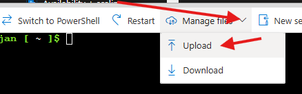

# mc-flatcar (WORK IN PROGRESS)

# Deploying Flatcar Minecraft Server on Azure

### This guide provides a parameterized Bash script to set up a Flatcar-based Minecraft server using Azure Cloud Shell. The script allows customization of variables such as resource group, VM size, and other configuration options.

## Prerequisites

-   You must have an Azure account with sufficient permissions.
-   You must have Azure Cloud Shell or CLI set up.

## Setup

The following script will guide you through deploying the Minecraft server on Flatcar.

### Connect to Azure

First make sure you are connected either via the Azure CLI or Azure Cloud Shell, and make sure you are logged int:

```bash
az login
```

### Accept the Flatcar Image Terms

First, accept the terms for the Flatcar image:

```bash
az vm image terms accept --publisher kinvolk --offer flatcar-container-linux-free --plan stable-gen2
```

### Set Variables
Edit the variables below to match your preferences:

```bash
# Set Variables
RESOURCE_GROUP="my-mc"                   # Resource Group Name
VM_NAME="mc-server"                      # VM Name
VM_SIZE="Standard_D2as_v4"               # VM Size (Adjust as needed)
LOCATION="eastus"                        # Azure Region
VNET_NAME="mc-vnet"                      # Virtual Network Name
SUBNET_NAME="default"                    # Subnet Name
```

### Create Virtual Network
Create a virtual network with a subnet for the Minecraft server:

```bash
az network vnet create \
  --resource-group $RESOURCE_GROUP \
  --name $VNET_NAME \
  --address-prefix 10.0.0.0/16 \
  --subnet-name $SUBNET_NAME \
  --subnet-prefix 10.0.0.0/24
```


### Config File: config.ign
Below is an example Flatcar configuration file (`config.ign`) used for setting up the Minecraft server and SFTP service:

(Currently the Flatcar configuration is not parameterized and the changes need to be manual)
```yaml
variant: flatcar
version: 1.0.0
storage:
  files:
    - path: /etc/systemd/system/sftp-mc.service
      mode: 0644
      contents:
        inline: |
          [Unit]
          Description=SFTP Server for PaperMC Data
          After=docker.service
          Requires=docker.service

          [Service]
          Restart=on-failure
          RestartSec=30
          StandardOutput=journal
          StandardError=journal
          ExecStart=/usr/bin/docker run --name sftp -p 2223:22 -v papermc-data:/home/minecraftuser/papermc ghcr.io/atmoz/sftp/debian minecraftuser:password:::papermc
          ExecStop=/usr/bin/docker stop sftp
          ExecStopPost=/usr/bin/docker rm sftp

          [Install]
          WantedBy=multi-user.target

    - path: /etc/systemd/system/minecraft.service
      mode: 0644
      contents:
        inline: |
          [Unit]
          Description=PaperMC Minecraft Server
          After=docker.service
          Requires=docker.service

          [Service]
          Restart=always
          RestartSec=20
          StandardOutput=journal
          StandardError=journal
          Environment="EULA=true"
          Environment="MC_VERSION=latest"
          Environment="PAPER_BUILD=latest"
          Environment="MC_RAM=4G"
          Environment="JAVA_OPTS=-Xms4G -Xmx4G -XX:+UseG1GC -XX:+UnlockExperimentalVMOptions -XX:G1NewSizePercent=20 -XX:G1ReservePercent=20 -XX:MaxGCPauseMillis=50 -XX:G1HeapRegionSize=32M"
          Environment="ENABLE_RCON=true"
          Environment="RCON_PASSWORD=your_rcon_password"
          Environment="RCON_PORT=25575"
          ExecStart=/usr/bin/docker run --name papermc -p 25565:25565 -p 25575:25575 --memory="4g" --memory-swap="4g"  -e EULA=true -e MC_VERSION=latest -e PAPER_BUILD=latest -e MC_RAM=4G -e JAVA_OPTS="-Xms4G -Xmx4G -XX:+UseG1GC -XX:+UnlockExperimentalVMOptions -XX:G1NewSizePercent=20 -XX:G1ReservePercent=20 -XX:MaxGCPauseMillis=50 -XX:G1HeapRegionSize=32M" -e ENABLE_RCON=true -e RCON_PASSWORD=your_rcon_password -e RCON_PORT=25575 -v papermc-data:/papermc phyremaster/papermc
          ExecStop=/usr/bin/docker stop papermc
          ExecStopPost=/usr/bin/docker rm papermc

          [Install]
          WantedBy=multi-user.target

systemd:
  units:
    - name: docker.service
      enabled: true
    - name: sftp-mc.service
      enabled: true
    - name: minecraft.service
      enabled: true
```

### Compiling the Config File with Butane

This section is easier to do locally. Open `config.yaml` and paste your configuration.

Transpile the Butane configuration (config.yaml) to Ignition configuration (config.ign) - it is possible to use [the Butane binary](https://coreos.github.io/butane/getting-started/#standalone-binary) or the Docker image:

```bash
docker run --rm -i quay.io/coreos/butane:latest < config.yaml > config.ign
```

If you are using Azure Cloud Shell you can upload `config.ign` file directly into your Cloud Shell Session:



Choose the file and upload it, after is it done uploading it should be visible in your home directory:

```bash
jan [ ~ ]$ ls
config.ign
```

### Deploy the VM
Create the Flatcar VM that will host the Minecraft server:

```bash
az vm create \
  --resource-group $RESOURCE_GROUP \
  --name $VM_NAME \
  --image kinvolk:flatcar-container-linux-free:stable-gen2:latest \
  --size $VM_SIZE \
  --admin-username core \
  --generate-ssh-keys \
  --custom-data config.ign \
  --vnet-name $VNET_NAME \
  --subnet $SUBNET_NAME \
  --location $LOCATION
```

### Open Ports for Minecraft
Open the necessary ports for Minecraft and RCON:

```bash
az vm open-port --resource-group $RESOURCE_GROUP --name $VM_NAME --port 25565 --priority 1001   # Minecraft default port
az vm open-port --resource-group $RESOURCE_GROUP --name $VM_NAME --port 25575 --priority 1002   # RCON port
az vm open-port --resource-group $RESOURCE_GROUP --name $VM_NAME --port 2223 --priority 1003   # SFTP port
```


### SSH into the VM
SSH into the virtual machine to check the status of the Minecraft and SFTP services:

```bash
ssh core@<your-vm-ip>
```

Check the status of the services:

```bash
sudo systemctl status minecraft.service
sudo systemctl status sftp-mc.service
```

### Connecting to RCON
You can connect to the Minecraft server using the RCON CLI:

```bash
docker run -it --rm itzg/rcon-cli --host <your-vm-ip> --port 25575 --password $RCON_PASSWORD
```
### Connecting via SFTP (Work in Progress)
You can connect via SFTP using the following command:

```bash
sftp -P 2223 minecraftuser@<your-vm-ip>
```
